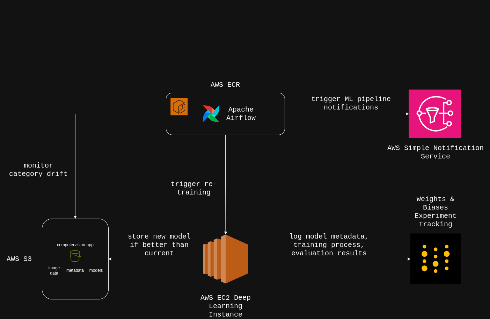

# ❗Work in Progress❗

## Continuous Learning Infrastructure
This project automates the process of detecting category drift in image labels, triggering retraining on AWS infrastructure. It integrates with AWS S3 for data storage, SNS for notifications, and EC2 for executing the retraining process.

  

## Overview

The system is designed to detect category drift in image datasets stored in S3. It uses a chi-square statistical test to compare the current image label distribution with a predefined baseline. If drift is detected, the system triggers the necessary actions, such as notifying stakeholders and initiating retraining on an EC2 instance.

Key Components:
- Airflow DAGs for orchestrating the tasks.
- AWS EC2 for running retraining scripts.
- S3 for data storage and retrieval.
- SNS for notifications when category drift is detected.
